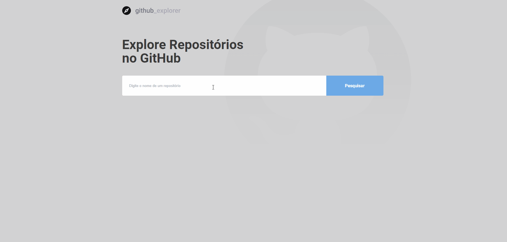

<h1>Github Explorer</h1>

In this project, the search for Github repositories is done through its API.
The main page has a field to perform the search and shows a list with the searched repositories.
Successfully found repositories are stored on local storage, so there is no need to re-search previously searched repositories if the page is refreshed.
When selecting a specific repository from the list, a new page is loaded with information from the selected repository.

